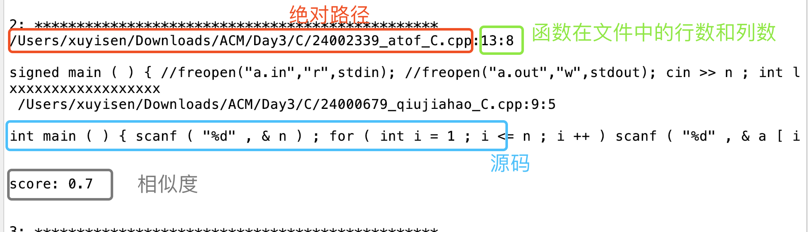

# parser

---

C++代码解析器

### Requirements:

* Python 3.7.4
* LLVM,版本为最新版本
* Clang，版本为最新版本
* MySQL 5.6

### Build

* 首先安装Python的ClangAPI接口，`pip install clang`。
* 查找LLVM中的`libclang.so`共享库的路径，并更新到parser.py中的`Config.set_library_file(libclangPath)`中的`libclangPath`。
	* 例子：mac安装完llvm的路径为`/usr/local/opt/llvm/lib/libclang.dylib`
	* 例子：windows安装完llvm的路径为`D:/Program Files/LLVM/bin/libclang.dll`
* 我是用数据库保存提取的数据，也可以修改为用文件保存，具体格式详见`cpp.sql`

---

# cpp_check

---

C++代码克隆检测

### Requirements:

* python 3.7.4 
* LLVM,版本为最新版本
* Clang,版本为最新版

### How to use 

* 首先将C++解释器部分Build部分的步骤重新配置一遍，注意更新`cpp_check.py`中的`libclangPath`路径，数据库部分可略过。
* 运行`python cpp_check.py`命令，注意这里一共有四个参数
	* `--f` :装有所有待检测cpp文件的文件夹，为必输项
	* `-mt` :最少token，有些函数太短了，没有必要检测，非必输项，默认值为`0`, 小函数的例子：
			```
			int main(){
				slove();
				return 0;
			}
			```
	* `-mins` :最小相似度，非必输项，默认值为`0.7`。
	* `-maxs` :最大相似度，非必输项，默认值为`1.0`。通过简单观察，相似度在`0.9-1.0`之间的代码克隆基本上为`Type I`(代码完全相同)和`Type II`(修改了部分变量)。相似度在`0.6-0.8`之间的代码基本为`Type II`(修改了部分变量)和`Type III`(增加或删除了部分代码)。
* 最终系统输出为一个`result.txt`文件：
	

### Example

* `python cpp_check.py --f /Users/xuyisen/Downloads/ACM/` :最小token为默认值`0`,最小相似度为默认值`0.7`,最大相似度为默认值`1.0`。
* `python cpp_check.py --f /Users/xuyisen/Downloads/ACM/ -mt 10 -mins 0.6 -maxs 0.7`,最小token为`10`,最小相似度为`0.6`,最大相似度为`0.7`。


---

# java_check

---

Java代码克隆检测

### Requirements:

* python 3.7.4 
* javalang,最新版本

### How to use 

* 安装Python的javalang包，`pip install javalang`
* 运行`python java_check.py`命令，注意这里一共有四个参数
	* `--f` :装有所有待检测cpp文件的文件夹，为必输项
	* `-mt` :最少token，有些函数太短了，没有必要检测，非必输项，默认值为`0`。
	* `-mins` :最小相似度，非必输项，默认值为`0.7`。
	* `-maxs` :最大相似度，非必输项，默认值为`1.0`。

### Example

* `python java_check.py --f /Users/xuyisen/Downloads/ACM/` :最小token为默认值`0`,最小相似度为默认值`0.7`,最大相似度为默认值`1.0`。
* `python java_check.py --f /Users/xuyisen/Downloads/ACM/ -mt 10 -mins 0.6 -maxs 0.7`,最小token为`10`,最小相似度为`0.6`,最大相似度为`0.7`。


---

# python_check

---

Python代码克隆检测

### Requirements:

* python 3.7.4 

### How to use 

* 运行`python python_check.py`命令，注意这里一共有四个参数
	* `--f` :装有所有待检测cpp文件的文件夹，为必输项
	* `-mt` :最少token，有些函数太短了，没有必要检测，非必输项，默认值为`0`。
	* `-mins` :最小相似度，非必输项，默认值为`0.7`。
	* `-maxs` :最大相似度，非必输项，默认值为`1.0`。

### Example

* `python python_check.py --f /Users/xuyisen/Downloads/ACM/` :最小token为默认值`0`,最小相似度为默认值`0.7`,最大相似度为默认值`1.0`。
* `python python_check.py --f /Users/xuyisen/Downloads/ACM/ -mt 10 -mins 0.6 -maxs 0.7`,最小token为`10`,最小相似度为`0.6`,最大相似度为`0.7`。
